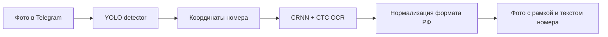
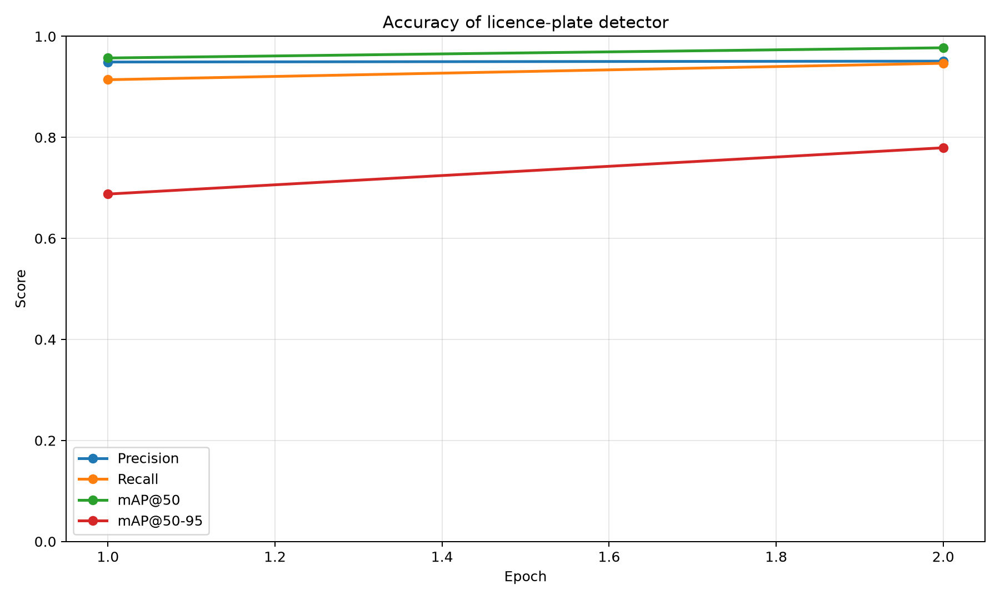
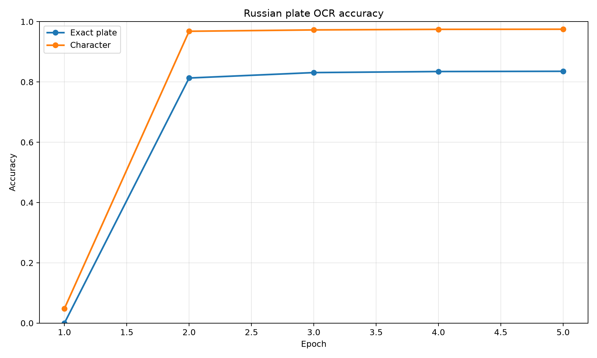
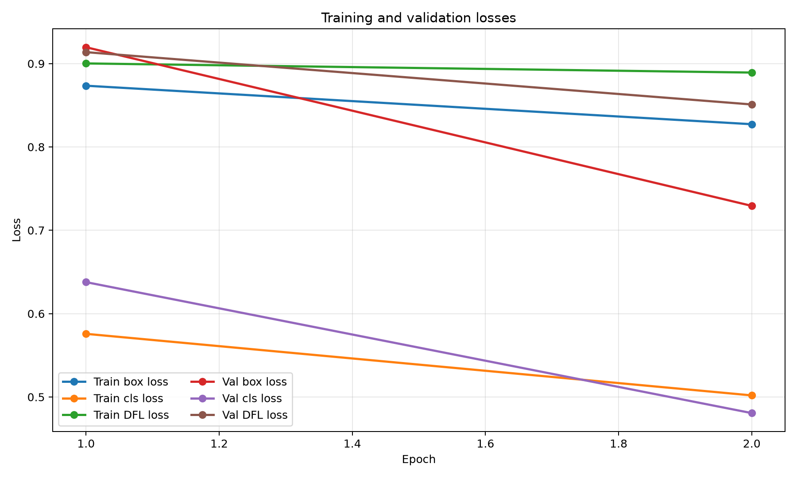
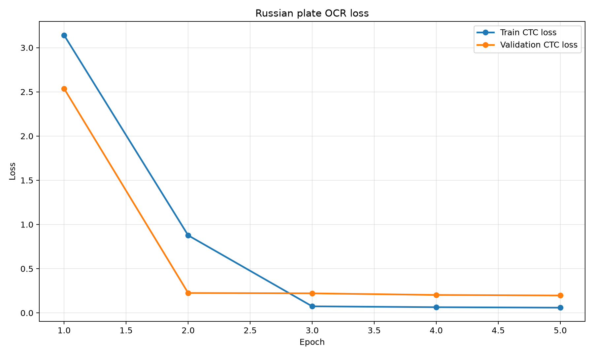

# 🚘 Russian Plate Vision Bot

Telegram-бот для поиска и распознавания российских автомобильных номеров на фотографии. Проект объединяет детектор **YOLO** и специализированный **CRNN + CTC OCR**, обученный на вырезках российских номеров.




## Решаемая задача

Автоматизировать проверку и регистрацию транспорта на КПП, парковках и закрытых территориях: сотрудник отправляет фото автомобиля, а система возвращает распознанный номер. Это уменьшает объём ручного ввода и число ошибок при идентификации автомобиля.

## Что умеет

- Находит один или несколько номеров на фотографии автомобиля.
- Возвращает исходное фото с выделенными рамками.
- Распознаёт номер и добавляет результат в подпись к фото.
- Использует OCR, обученный на российских номерах; до обучения модели автоматически применяется EasyOCR.
- Работает локально через long polling — фотографии не отправляются в сторонние сервисы этим проектом.

## Качество моделей

| Задача | Набор для проверки | Результат |
| --- | --- | --- |
| Детекция номера | validation, 2 563 изображения | Precision **95,09%**, Recall **94,67%**, mAP@50 **97,73%**, mAP@50–95 **77,94%** |
| OCR: полный номер | независимый test, 2 845 изображений | **85,03%** |
| OCR: отдельный символ | независимый test, 2 845 изображений | **97,59%** |

<table>
  <tr>
    <td></td>
    <td></td>
  </tr>
  <tr>
    <td align="center">Детектор: precision, recall, mAP</td>
    <td align="center">OCR: точность номера и символов</td>
  </tr>
</table>

<table>
  <tr>
    <td></td>
    <td></td>
  </tr>
  <tr>
    <td align="center">Функции потерь детектора</td>
    <td align="center">CTC loss OCR</td>
  </tr>
</table>

> [!NOTE]
> Результат на фотографии зависит от качества обеих стадий: детекции и OCR. Размытые, маленькие, наклонённые или ночные номера распознаются хуже, чем тестовые вырезки.

## Быстрый старт

Требуется Python 3.11–3.13. CUDA необязательна, но заметно ускоряет обучение и обработку.

```powershell
py -3.12 -m venv .venv
.\.venv\Scripts\Activate.ps1
pip install -r requirements.txt
```

Создайте локальный файл `.env`, получите токен у [@BotFather](https://t.me/BotFather) и задайте как минимум `TELEGRAM_BOT_TOKEN`. Остальные параметры описаны в таблице ниже. Файлы с весами, датасеты, токены и логи намеренно не хранятся в Git.

```powershell
python -m app.bot
```

Отправьте боту фотографию автомобиля как изображение. Команда `/status` покажет загруженную модель и текущие параметры.

## Конфигурация

| Переменная | Значение по умолчанию | Назначение |
| --- | --- | --- |
| `MODEL_PATH` | `models/license_plate_detector.pt` | веса YOLO-детектора |
| `CONFIDENCE` | `0.35` | минимальная уверенность детектора |
| `DEVICE` | `cpu` | `cpu` или `0` для первой NVIDIA GPU |
| `ENABLE_OCR` | `true` | включить распознавание текста номера |

## Обучение и оценка

Подготовьте локальные датасеты в `data/car_plate_detecting` и `data/car_plate_ocr` (они не входят в репозиторий), затем выполните:

```powershell
# Детектор
python scripts/prepare_detection_dataset.py
python scripts/train_detector.py --epochs 50 --imgsz 960 --device 0 --workers 0
python scripts/plot_metrics.py --run-dir runs/plate_detector_finetune

# OCR для российского формата номера
python scripts/train_ocr.py --epochs 12 --batch 256 --device cuda:0 --workers 0
python scripts/plot_ocr_metrics.py --run-dir runs/plate_ocr
python scripts/evaluate_ocr.py --device cuda:0
```

Лучшие веса автоматически записываются в:

- `models/license_plate_detector.pt`
- `models/plate_ocr_crnn.pt`

## Структура проекта

```text
app/                  Telegram-бот, конфигурация, YOLO и OCR
scripts/              подготовка датасета, обучение, оценка и графики
docs/images/          графики качества, отображаемые в README
data/                 локальные датасеты (игнорируются Git)
models/               локальные веса (игнорируются Git)
runs/                 сырые эксперименты и чекпоинты (игнорируются Git)
```

## Данные и ответственное использование

- Для детекции использован [Russian car plate detecting dataset](https://nomeroff.net.ua/datasets/autoriaNumberplateDataset-2023-03-06.zip), основанный на Nomeroff Net.
- Для OCR использован набор российских номеров на базе [Nomeroff Net](https://nomeroff.net.ua/); исходный датасет распространяется по CC BY 4.0.
- Номер автомобиля в конкретном контексте может быть персональными данными. Обрабатывайте только те изображения, на которые у вас есть право, и не храните полученные фотографии без необходимости.
